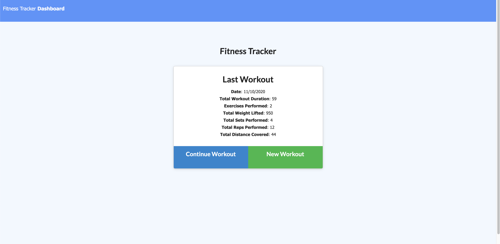
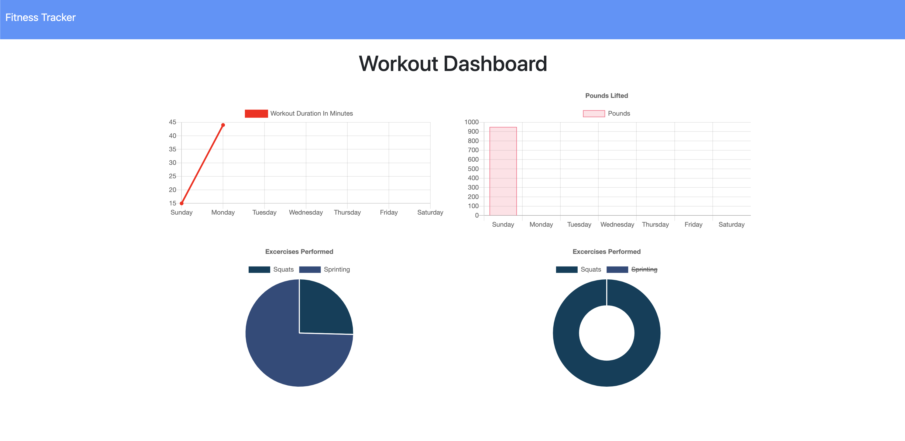

## Workout-Tracker

This app lets a user create a workout (cardio or resistance), and store the details of the workout. It uses a mongo database as part of the back end

# Our Task

Completed the back end for a pre made workout app. We'll be using Node, Express, MongoDB (a nosql database), and Mongoose to aid in our data structuring.

# Installation

Run NPM init, then npm install to install all the required node modules.

# Usage

To use the app, either start it locally with nodemon server.js, or navigate to the live heroku site @ https://shielded-plains-14959.herokuapp.com/

Follow the onscreen prompts to add the different workout types. You can also navigate to the dashboard by clicking the "Dashboard" button on the top left of the screen. 

# Pictures of deployed Application 

